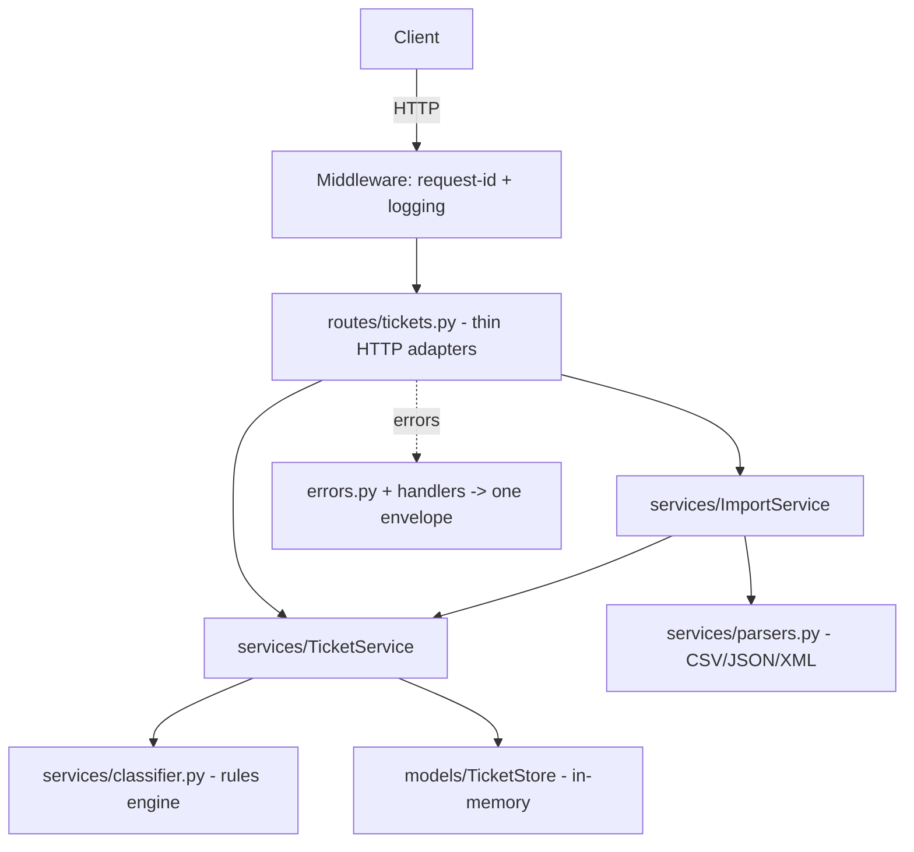

# 🎧 Homework 2: Intelligent Customer Support System

> **Author**: Anton Tsiatsko · **Stack**: Python 3.10+ / FastAPI / Pydantic v2 / pytest
> **AI tools**: Claude Code (Opus 4.8) — built with the Context → Model → Prompt method.

An in-memory customer-support ticket API: create and manage tickets, **bulk-import from
CSV / JSON / XML**, and **auto-classify** category and priority from ticket text. Built
TDD-first to the same quality bar as homework-1 (one error envelope, request-id tracing,
safe 500s) with a full local quality gate (ruff · mypy · bandit · radon · coverage ≥ 95%).

---

## ✨ Features

- **Ticket CRUD** with filtering (`category`, `priority`, `status`, `assigned_to`).
- **Multi-format bulk import** (CSV, JSON, XML) with a per-row success/failure summary;
  one bad row never aborts the batch, and a malformed *file* is rejected with a clear 400.
- **Auto-classification** (`POST /tickets/{id}/auto-classify`) returning category, priority,
  a confidence score, human-readable reasoning, and the matched keywords. Available as an
  opt-in flag on create and import (`?auto_classify=true`).
- **Production hygiene**: one `{error, details[]}` envelope for every failure, an
  `X-Request-ID` on every response, tracebacks never leaked to clients, `/health` + Swagger.
- **Safe XML** parsing via `defusedxml` (XXE/entity-expansion blocked).

## 🏗️ Architecture



Dependencies point inward: **routes → services → models**. Validation lives in the Pydantic
models; business logic lives in services; routes only translate HTTP. See
[`docs/ARCHITECTURE.md`](docs/ARCHITECTURE.md) for component detail and data-flow diagrams.

## 🚀 Installation & setup

```bash
cd homework-2
python3 -m venv .venv
./.venv/bin/python -m pip install -r requirements-dev.txt   # runtime + tooling
./demo/run.sh        # starts the API on http://localhost:3000  (Swagger at /docs)
```

Sample requests are in [`demo/sample-requests.http`](demo/sample-requests.http); ready-made
datasets are in [`samples/`](samples) (50 CSV, 20 JSON, 30 XML, plus invalid files).

## 🧪 Running tests

```bash
./.venv/bin/python -m pytest --cov=src --cov-report=term-missing   # 75 tests, ≥95% coverage
./demo/quality.sh    # full gate: ruff · mypy · bandit · radon · pytest+coverage
```

See [`docs/TESTING_GUIDE.md`](docs/TESTING_GUIDE.md) for the test pyramid, fixtures, and a
manual testing checklist. Full endpoint reference: [`docs/API_REFERENCE.md`](docs/API_REFERENCE.md).

## 📁 Project structure

```
homework-2/
├── src/
│   ├── main.py             # app factory, middleware, exception handlers
│   ├── config.py           # immutable Settings (injected)
│   ├── errors.py           # ApiError + one error envelope
│   ├── models/             # Pydantic entities, enums, view DTOs, in-memory store
│   ├── routes/             # thin HTTP adapters + dependency providers
│   └── services/           # TicketService, ImportService, classifier, parsers
├── tests/                  # 9 test files + fixtures/  (pytest)
├── docs/                   # API_REFERENCE, ARCHITECTURE, TESTING_GUIDE, screenshots/
├── samples/                # deliverable sample datasets (valid + invalid)
├── demo/                   # run.sh, quality.sh, sample-requests.http
└── pyproject.toml          # ruff / mypy / bandit / pytest / coverage config
```

---

<div align="center">

*Completed as part of the AI-Assisted Development course. Documentation generated with
Claude Opus 4.8 (developer docs), chosen for structural reasoning over the codebase.*

</div>
