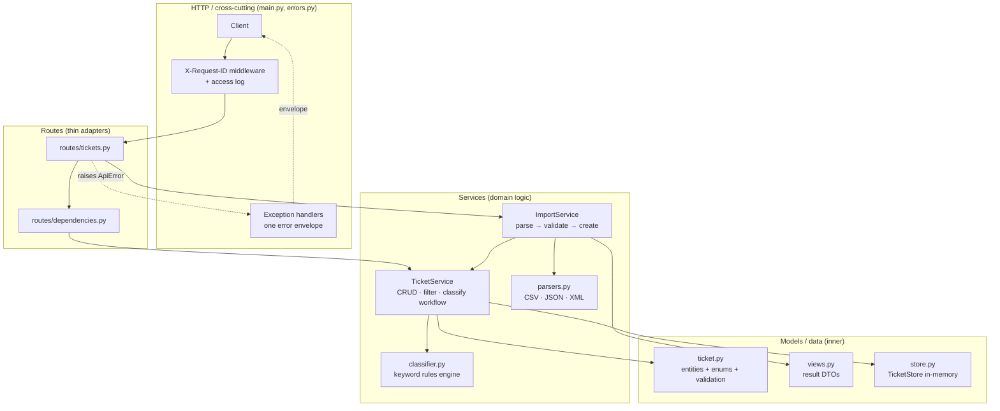
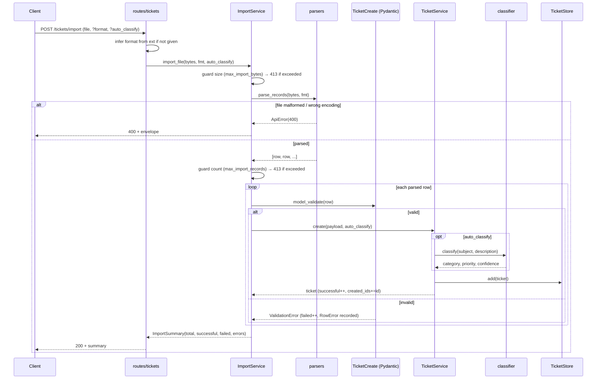

# Architecture — Intelligent Customer Support System

This document is written for technical leads who need to understand the shape of the
system, why it is structured the way it is, and how data flows through it. The codebase
is a small FastAPI service that ingests customer-support tickets (single create or bulk
CSV/JSON/XML import) and auto-classifies them with a transparent rules engine.

## Layering at a glance

Dependencies point strictly **inward**: `routes → services → models/store`. Routes are
thin HTTP adapters and never contain domain logic; services own all use-cases and return
view-model DTOs; models hold the entities, validation rules, and the persistence seam.
Nothing in `models`/`store` imports `services`, and nothing in `services` imports
`routes`.

## High-level view



Every response carries an `X-Request-ID`; every failure — whether a route/service
`ApiError`, a Pydantic `RequestValidationError`, a Starlette `HTTPException`, or an
unexpected `Exception` — is funneled through the same handlers in `main.py` and rendered
as one envelope.

## Components

| Layer | Module | Responsibility |
|---|---|---|
| HTTP | `src/main.py` | `create_app(settings)` factory; builds per-app state on `app.state` (store + services); registers the X-Request-ID/access-log middleware and the four exception handlers; mounts the router and `/health` and `/`. |
| HTTP | `src/errors.py` | `ApiError`/`NotFound` exception types and `error_body(...)`, which produces the single `{error, details[], requestId}` envelope. |
| Routes | `src/routes/tickets.py` | Thin adapters for the `/tickets` endpoints: read the request, call a service, return its result. Holds no domain logic beyond format inference for uploads. |
| Routes | `src/routes/dependencies.py` | FastAPI dependency providers that pull `TicketService`/`ImportService` off `app.state`, keeping handlers thin and letting tests swap state. |
| Services | `src/services/ticket_service.py` | All ticket use-cases: id/timestamp generation, partial update, terminal-status `resolved_at` handling, filtering, the classification workflow, and per-decision structured logging. |
| Services | `src/services/import_service.py` | Bulk-import orchestration: size/count DoS guards (413), parse → per-row validate → create, and an `ImportSummary` of total/successful/failed with per-row error detail. One bad row never aborts the import. |
| Services | `src/services/parsers.py` | Turn raw file bytes into canonical row dicts for CSV/JSON/XML behind one `parse_records` interface; folds flat fields into nested `metadata`/`tags`; rejects malformed files with 400; XML parsed via `defusedxml`. |
| Services | `src/services/classifier.py` | Pure, deterministic keyword rules engine: returns category, priority, confidence, human-readable reasoning, and the exact keywords matched. No external state. |
| Models | `src/models/ticket.py` | Domain entities (`Ticket`), enums, and inbound payloads (`TicketCreate`/`TicketUpdate`). **All field validation lives here** (types, enum membership, length bounds, email). |
| Models | `src/models/views.py` | Transport-agnostic result DTOs returned by services: `ImportSummary`, `RowError`, `ClassificationResult`. |
| Models | `src/models/store.py` | `TicketStore` in-memory persistence behind a small interface (`add`/`get`/`list`/`delete`) — the single seam for a future database. |

## Data flow — bulk import with auto-classify



## Data flow — auto-classify an existing ticket

```mermaid
sequenceDiagram
    participant C as Client
    participant R as routes/tickets
    participant TS as TicketService
    participant CL as classifier
    participant DB as TicketStore

    C->>R: POST /tickets/{id}/auto-classify
    R->>TS: auto_classify(id)
    TS->>DB: get(id)
    alt found
        DB-->>TS: ticket
        TS->>CL: classify(subject, description)
        CL->>CL: lowercase text, word-boundary keyword match
        CL-->>TS: ClassificationResult(category, priority, confidence, reasoning, keywords)
        TS->>TS: write category/priority/confidence onto ticket; log decision
        TS-->>R: ClassificationResult
        R-->>C: 200 + result
    else missing
        DB-->>TS: None
        TS-->>R: NotFound (404)
        R-->>C: 404 + envelope
    end
```

## Design decisions & trade-offs

- **Validation lives in Pydantic, in one place.** Both the single-create API and every
  parsed import row are funneled through the same `TicketCreate` model, so rules (email
  format, length bounds, enum membership, required `metadata`) are defined exactly once.
  Trade-off: import error messages inherit Pydantic's wording — acceptable, and they are
  mapped into our `{field, message}` detail shape so callers still get the standard
  envelope.
- **Rules-based classifier with whole-token / word-boundary matching.** Classification is
  deterministic, instant, free, and explainable: every keyword is pre-compiled to a
  `\b<keyword>\b` regex, so matching respects word boundaries. This means `"security"`
  does **not** match inside `"insecurity"`, and `"500"` does not match inside `"1500"`.
  The engine returns the exact keywords it matched plus human-readable reasoning. Category
  is chosen by match count with declaration order as the tie-breaker; priority is the first
  matching tier. Trade-off: no semantic understanding — mitigated by ordered tie-breaking
  and an honest low confidence (`0.3`) when nothing matches and the category defaults to
  `other`. The whole engine is isolated behind `classify()`, so an ML/LLM backend could
  replace it without touching routes or services.
- **In-memory store behind an interface.** `TicketStore` exposes a tiny `add/get/list/delete`
  surface, keeping the service runnable with zero setup. That interface is the single seam
  to swap in a real database later — routes and services would not change.
- **Per-app factory, no module globals.** `create_app(settings)` builds an isolated app with
  its own store and services on `app.state`. Every test gets fresh state, configuration is
  injected rather than read from hidden globals, and a module-level `app = create_app()`
  still serves `uvicorn src.main:app`.
- **One error envelope + request id.** All failures (400/404/413/422/500) render through the
  same `{error, details[], requestId}` body and carry an `X-Request-ID`, giving clients a
  uniform experience and end-to-end traceability.

## Security considerations

- **XXE-safe XML parsing.** XML imports go through `defusedxml`, which refuses external
  entity references and entity-expansion ("billion laughs") attacks; a hostile XML file is
  rejected as a malformed file (400) rather than triggering file/network access.
- **Boundary validation.** Every inbound field is type-, enum-, length-, and email-checked
  by Pydantic at the edge before any domain code runs, so malformed or oversized field
  values never reach the store.
- **Import size/count DoS guards → 413.** Bulk import enforces a byte-size cap
  (`max_import_bytes`) before parsing and a record-count cap (`max_import_records`) after
  parsing; exceeding either returns `413` instead of exhausting memory.
- **No information leakage on 500.** The catch-all exception handler logs full exception
  detail server-side but returns only a generic `"Internal server error"` envelope to the
  caller — no stack traces or internal messages cross the boundary.

## Performance considerations

- **Parsing and classification are O(n)** in the size of the input. Classification is pure
  string scanning over a fixed, pre-compiled keyword set, with no backtracking on input
  length.
- **Store get/add are O(1)** (dict-keyed by id); `delete` is O(1); `list`/filter are O(n)
  over the current ticket set.
- **Performance is tested.** `tests/test_performance.py` asserts time bounds for 200
  sequential creates, a 500-row CSV import, unfiltered and filtered listing over 500
  tickets, and 100 repeated classifications of a near-max-length description — catching
  accidentally quadratic regressions while staying tolerant of slow CI.

---

*Generated with Claude Opus 4.8 — architecture (reasoning and multi-diagram data-flow modeling).*
