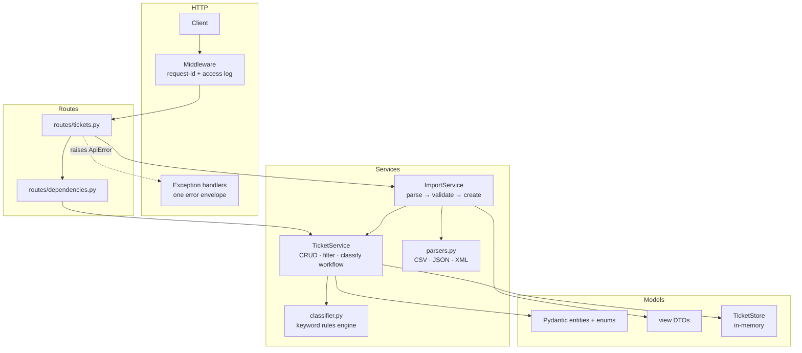
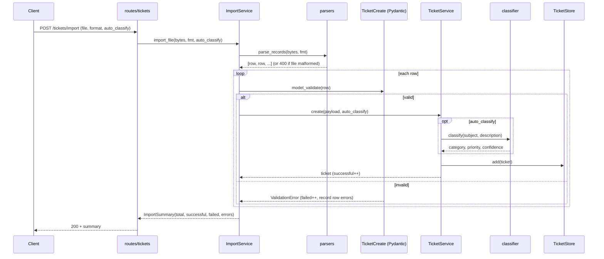
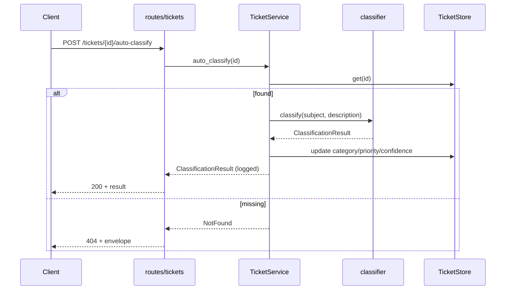

# Architecture — Intelligent Customer Support System

## High-level view

## Components

| Layer | Module | Responsibility |
|---|---|---|
| HTTP | `main.py` | App factory, per-app state on `app.state`, middleware, exception handlers |
| HTTP | `errors.py` | `ApiError`/`NotFound` + the single `{error, details[], requestId}` envelope |
| Routes | `routes/tickets.py` | Thin adapters: parse request, call a service, shape the response |
| Routes | `routes/dependencies.py` | Provide services from `app.state` to handlers |
| Services | `ticket_service.py` | All ticket use-cases: id/timestamp generation, filtering, classification workflow, decision logging |
| Services | `import_service.py` | Orchestrate bulk import; per-row validation; success/failure summary; size/count guards |
| Services | `parsers.py` | Turn raw bytes into canonical rows for CSV/JSON/XML behind one interface; safe XML |
| Services | `classifier.py` | Pure keyword rules → category, priority, confidence, reasoning, keywords |
| Models | `models/ticket.py` | Entities, enums, create/update payloads; **all validation** |
| Models | `models/views.py` | Transport-agnostic result DTOs (`ImportSummary`, `ClassificationResult`) |
| Models | `models/store.py` | In-memory persistence behind a small swappable interface |

## Data flow — bulk import with auto-classify

## Data flow — auto-classify an existing ticket

## Design decisions & trade-offs

- **Validation in one place (Pydantic).** Both the API and the import path build the same
  `TicketCreate`, so rules (email, length bounds, enums) are defined once. Trade-off: import
  error messages are Pydantic's wording — acceptable, and they are mapped into our envelope.
- **Rules-based classifier, not an LLM.** Deterministic, instant, testable, and free; it
  returns the exact keywords it matched so decisions are explainable. Trade-off: no semantic
  understanding — mitigated by ordered tie-breaking and an honest low confidence for `other`.
  The classifier is isolated behind `classify()`, so an ML/LLM backend could replace it
  without touching routes or services.
- **In-memory store behind an interface.** Keeps the homework runnable with zero setup; the
  `TicketStore` interface is the single seam to swap in a database later.
- **Per-app state via a factory.** `create_app(settings)` gives every test isolated state and
  removes module-level globals.
- **One error envelope + request-id.** Uniform client experience and traceability across
  400/404/413/500; 500s log full detail server-side but never leak it to callers.

## Security considerations

- **XXE-safe XML** via `defusedxml` (external entities and entity expansion are refused).
- **Input validation at the boundary**: every field is type/'enum/length/email-checked.
- **DoS guards**: import file-size (`max_import_bytes`) and record-count (`max_import_records`)
  limits return `413` rather than exhausting memory.
- **No information leakage**: unexpected errors return a generic 500; `bandit` runs in the gate.

## Performance considerations

- Parsing and classification are **O(n)** in input size; classification is pure string
  scanning over a fixed keyword set.
- Store operations are dict-based **O(1)** for get/add/delete; list/filter are **O(n)**.
- `test_performance.py` asserts bounds for 200 creates, a 500-row import, and listing.

---

*Generated with Claude Opus 4.8 — chosen for architectural reasoning, trade-off analysis,
and multi-diagram data-flow modeling.*
