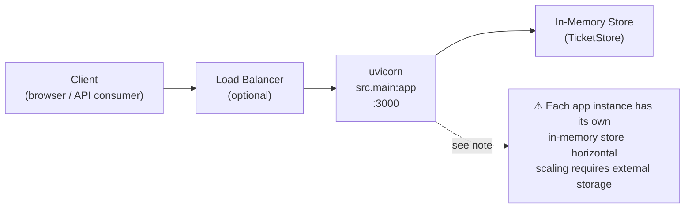

# Deployment & Operations — Intelligent Customer Support API

## Overview

The application is a **FastAPI** service served by **uvicorn**. All ticket data is held in an **in-memory `TicketStore`** that lives on `app.state` for the lifetime of the process.

Key operational implications:

- **Single-process only** (by default). A second worker process has its own independent store; the two cannot share data.
- **State is not persisted.** A process restart wipes all tickets. If durability is required, add an external database and replace the in-memory store before deploying to production.
- The app module is `src.main:app` (a module-level instance created at import time via `create_app()`).

---

## Prerequisites

| Requirement | Minimum version |
|---|---|
| Python | 3.10 |
| pip | any recent release |

No external services (databases, message queues, caches) are required for the default in-memory configuration.

---

## Local Run

### Using the provided helper script

```bash
# From the homework-2 directory:
./demo/run.sh
```

The script:
1. Creates a `.venv` virtual environment if one does not already exist.
2. Installs `requirements.txt` into that environment.
3. Starts uvicorn: `uvicorn src.main:app --host 0.0.0.0 --port 3000`

The API is then available at `http://localhost:3000`. Swagger UI is served at `http://localhost:3000/docs`.

### Manual uvicorn command

```bash
python3 -m venv .venv
source .venv/bin/activate
pip install -r requirements.txt
uvicorn src.main:app --host 0.0.0.0 --port 3000
```

---

## Configuration / Environment Variables

Settings are loaded by `src/config.py` (`Settings.from_env()`) at startup. All variables are optional; the defaults are production-safe for a low-volume deployment.

| Variable | Default | Description |
|---|---|---|
| `MAX_IMPORT_RECORDS` | `1000` | Maximum number of records accepted in a single bulk-import request. Requests that exceed this limit are rejected with HTTP 413 as a DoS guard. |
| `MAX_IMPORT_BYTES` | `5000000` | Maximum file size (bytes) accepted for a bulk-import upload (~4.8 MB). Requests that exceed this limit are rejected with HTTP 413. |
| `LOG_LEVEL` | `INFO` | Python logging level passed to `logging.basicConfig`. Valid values: `DEBUG`, `INFO`, `WARNING`, `ERROR`, `CRITICAL`. |

Set these in the shell, in a `.env` file sourced before starting uvicorn, or as Docker `--env` / `ENV` directives:

```bash
export MAX_IMPORT_RECORDS=500
export MAX_IMPORT_BYTES=2000000
export LOG_LEVEL=DEBUG
uvicorn src.main:app --host 0.0.0.0 --port 3000
```

---

## Docker

### Minimal Dockerfile

```dockerfile
FROM python:3.11-slim

WORKDIR /app

COPY requirements.txt .
RUN pip install --no-cache-dir -r requirements.txt

COPY src/ ./src/

CMD ["uvicorn", "src.main:app", "--host", "0.0.0.0", "--port", "3000"]
```

### Build and run

```bash
# Build
docker build -t support-api:latest .

# Run (with optional env overrides)
docker run --rm \
  -p 3000:3000 \
  -e MAX_IMPORT_RECORDS=500 \
  -e LOG_LEVEL=INFO \
  support-api:latest
```

The container exposes port `3000`. Map it to any host port with `-p <host-port>:3000`.

---

## Health & Observability

### Health endpoint

```
GET /health
```

Returns `{"status": "ok"}` with HTTP 200. Use this endpoint for both **liveness** and **readiness** probes — the app has no external dependencies whose readiness needs to be checked separately.

```bash
curl http://localhost:3000/health
# {"status":"ok"}
```

### Request tracing

Every response — success or error — carries an `X-Request-ID` header containing a UUID v4 generated per request by the middleware. Correlate this ID across:

- The client response headers.
- Server access-log lines (logged at `INFO` level in the format `METHOD /path -> STATUS (Xms) rid=<uuid>`).
- Error envelopes returned in the response body (`request_id` field).

### Structured access logs

The `observe` middleware emits one `INFO` log line per request:

```
INFO METHOD /path -> STATUS_CODE (duration_ms) rid=REQUEST_ID
```

Pipe uvicorn output to your log aggregator (Datadog, CloudWatch, Loki, etc.) and index on `rid` for distributed tracing.

### Error handling

- **400** — validation failure; details included in the response body, no traceback.
- **413** — import payload exceeds `MAX_IMPORT_RECORDS` or `MAX_IMPORT_BYTES`.
- **500** — unexpected error; the full traceback is written to the server log only; the client receives a generic `"Internal server error"` message with no leaked internals.

---

## Deployment Topology



> **Horizontal scaling caveat.** Because state lives in process memory, running multiple replicas behind a load balancer will result in split state: a ticket created on replica A is invisible to replica B. To scale horizontally, replace `TicketStore` with a shared external data store (PostgreSQL, Redis, etc.) before adding replicas.

---

## Operational Considerations

### Single-instance recommendation

For the current in-memory implementation, run exactly **one** process instance. If high availability is needed, implement persistence first (see the scaling caveat above).

### Import DoS protection

Two guards are enforced at the service layer and returned as HTTP 413:

- Record count exceeds `MAX_IMPORT_RECORDS`.
- Uploaded file size exceeds `MAX_IMPORT_BYTES`.

Tune these values to match your expected import workload before deploying.

### No traceback leakage on 500s

The global exception handler in `src/main.py` logs the full exception (including traceback) at `ERROR` level server-side and returns only `{"error": "Internal server error", ...}` to the client. Sensitive stack frames are never exposed over the wire.

### Process restart = data loss

There is no persistence layer. A crash, OOM kill, or rolling deployment will lose all in-memory tickets. Acceptable for demos and development; not acceptable for production without adding a database.

---

## Pre-Deploy Checklist

- [ ] Run the quality gate and confirm it exits green:
  ```bash
  ./demo/quality.sh
  ```
  This executes ruff (lint), mypy (types), bandit (security), radon (complexity), and pytest with ≥ 95% coverage.
- [ ] Set required environment variables (`MAX_IMPORT_RECORDS`, `MAX_IMPORT_BYTES`, `LOG_LEVEL`) for the target environment.
- [ ] Build the Docker image and verify the health endpoint responds:
  ```bash
  docker build -t support-api:latest .
  docker run -d -p 3000:3000 support-api:latest
  curl http://localhost:3000/health
  ```
- [ ] Confirm your log aggregator is capturing uvicorn stdout (the access-log stream).
- [ ] If deploying behind a load balancer, verify it is configured to send all traffic to a **single** instance until external storage is integrated.

---

*Generated with Claude Sonnet 4.6 — deployment & operations guide.*
