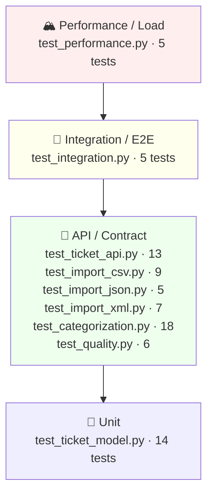

# Testing Guide — Intelligent Customer Support System

## Test pyramid



Most tests are fast unit/contract tests; a thin layer of end-to-end and performance tests sits on top. All run in-process via FastAPI's `TestClient` against a freshly-built app, so there is **no shared state** between tests.

## How to run tests

### Setup

```bash
cd homework-2
python3 -m venv .venv
source .venv/bin/activate
pip install -r requirements-dev.txt
```

### Run all tests with coverage

```bash
python -m pytest --cov=src --cov-report=term-missing
```

This runs all 82 tests with coverage reporting. The gate fails if coverage falls below 95%.

### Run a single test file

```bash
python -m pytest tests/test_categorization.py -v
```

### Run a single test

```bash
python -m pytest tests/test_ticket_api.py::test_combined_filter_by_category_and_priority -v
```

### Generate HTML coverage report

```bash
python -m pytest --cov=src --cov-report=html
open htmlcov/index.html
```

### Full quality gate (ruff · mypy · bandit · radon · pytest + coverage)

```bash
./demo/quality.sh
```

This is the CI-equivalent check that enforces style, type safety, security, complexity, and coverage.

## Test suites & focus areas

| Suite | Focus | Tests | Test cases | Remarks |
|---|---|---|---|---|
| `test_ticket_api.py` | Endpoints, status codes, filtering | 13 | 13 | Core REST API (create, read, update, delete, list, filter) |
| `test_ticket_model.py` | Pydantic validation, bounds, enums | 14 | 14 | Enum validation, length bounds (subject 1–200, description 10–2000), email format, metadata structure |
| `test_import_csv.py` | CSV parsing, error handling, limits | 9 | 9 | Row-level errors, size/record limits, tag splitting, format inference, encoding |
| `test_import_json.py` | JSON parsing, malformed syntax, wrappers | 5 | 5 | Array vs. wrapped object, invalid syntax, null handling |
| `test_import_xml.py` | XML parsing, malformed, XXE security | 7 | 7 | Nested tags, bare document, XXE protection (defusedxml), malformed markup |
| `test_categorization.py` | Category & priority classification rules, endpoint | 18 | 18 | Keyword-based rules (account_access, technical_issue, billing_question, feature_request, bug_report), priority escalation, endpoint update, confidence tracking |
| `test_integration.py` | Full lifecycle, bulk + classify, concurrency | 5 | 5 | Create → update → resolve → delete, concurrent creates (25 parallel), mixed import + classification, multi-format import |
| `test_performance.py` | Performance benchmarks with asserted bounds | 5 | 5 | 200 sequential creates < 10s, 500-row import < 10s, list/filter < 3s, 100 classify calls < 5s |
| `test_quality.py` | Error envelope, request-id propagation, safe 500s | 6 | 6 | Consistent error format, request-id echoing, unclassified→classified flow, docs availability |

**Overall: 82 tests, ~98% coverage, gate fail_under=95%**

## Sample & fixture data locations

### Test fixtures (small, controlled inputs)
Located in `tests/fixtures/`:
- **valid.csv** – 3 valid ticket rows for import testing
- **invalid_row.csv** – 1 valid + 1 invalid row (email mismatch) for error handling
- **valid.json** – 2 valid tickets in JSON array
- **valid.xml** – 2 valid tickets in XML with nested tags and metadata
- **xxe.xml** – XXE (XML External Entity) injection payload; must be blocked without disclosure

### Sample data (deliverable datasets for manual testing)
Located in `samples/`:
- **sample_tickets.csv** – 50 complete, realistic ticket records with all fields
- **sample_tickets.json** – 20 ticket objects in JSON array
- **sample_tickets.xml** – 30 ticket records in nested XML structure
- **invalid_tickets.csv** – Malformed CSV (bad emails, missing required fields)
- **invalid_tickets.json** – Invalid JSON syntax
- **invalid_tickets.xml** – Invalid XML markup

## Manual testing checklist

### Health & documentation
- [ ] Start the API: `./demo/run.sh`
- [ ] `GET /health` returns `{"status": "ok"}`
- [ ] `GET /docs` renders Swagger UI with all endpoints listed
- [ ] `GET /openapi.json` returns valid OpenAPI schema

### Create ticket (valid & invalid)
- [ ] `POST /tickets` with valid body → `201`, includes `id`, `created_at`, `updated_at`, `status=new`, `resolved_at=null`
- [ ] `POST /tickets` with missing required field (e.g., `customer_email`) → `400` with `error: "Validation failed"` and `details[]` array
- [ ] `POST /tickets` with invalid email → `400` validation error
- [ ] `POST /tickets` with subject < 1 char or > 200 chars → `400`
- [ ] `POST /tickets` with description < 10 chars or > 2000 chars → `400`
- [ ] `POST /tickets?auto_classify=true` with "critical" keywords → category and priority auto-populated, confidence score recorded

### Import (valid data)
- [ ] `POST /tickets/import` with `samples/sample_tickets.csv` → `200`, `successful: 50`, `failed: 0`
- [ ] `POST /tickets/import` with `samples/sample_tickets.json` → `200`, `successful: 20`
- [ ] `POST /tickets/import` with `samples/sample_tickets.xml` → `200`, `successful: 30`
- [ ] List after all imports → `GET /tickets` returns 100 tickets (50+20+30)

### Import (invalid data)
- [ ] `POST /tickets/import` with `samples/invalid_tickets.csv` → `200`, partial success with per-row error details in response
- [ ] `POST /tickets/import` with `samples/invalid_tickets.json` (malformed) → `400` with error envelope
- [ ] `POST /tickets/import` with `samples/invalid_tickets.xml` (malformed) → `400` with error envelope

### Auto-classification
- [ ] Create a ticket with subject "Can't access account" and description "I forgot my password. This is critical, locked out." → auto-classified as `category=account_access`, `priority=urgent`
- [ ] Create a ticket with subject "App crash" and description "The app keeps crashing. This is critical." → auto-classified as `category=technical_issue`, `priority=urgent`
- [ ] `POST /tickets/{id}/auto-classify` on existing ticket → updates `category`, `priority`, `classification_confidence`
- [ ] Check that `classification_confidence` is a float between 0.0 and 1.0

### Filtering
- [ ] `GET /tickets?category=account_access` → only tickets with that category
- [ ] `GET /tickets?priority=urgent` → only tickets with priority=urgent
- [ ] `GET /tickets?category=billing_question&priority=high` → combined filter, only matching tickets
- [ ] `GET /tickets?status=resolved` → only resolved tickets

### CRUD operations
- [ ] Create a ticket; `GET /tickets/{id}` → returns the exact ticket
- [ ] `PUT /tickets/{id}` with `{"assigned_to": "agent-5"}` → partial update, only that field changes, `updated_at` advances
- [ ] `PUT /tickets/{id}` with `{"status": "resolved"}` → sets `resolved_at` to current timestamp
- [ ] `PUT /tickets/{id}` with `{"status": "in_progress"}` from resolved → clears `resolved_at`
- [ ] `DELETE /tickets/{id}` → `204` No Content
- [ ] `GET /tickets/{id}` after delete → `404` Not Found
- [ ] `GET /tickets/does-not-exist` → `404` with error envelope

### Request identification
- [ ] Every HTTP response includes `X-Request-ID` header (UUID format)
- [ ] Error responses include `requestId` field in JSON body matching the header
- [ ] Requests can be traced end-to-end via request ID

### Edge cases
- [ ] Import with 0 rows (header only) → `200`, `total=0`, `successful=0`, `failed=0`
- [ ] Concurrent creates (load testing) → all complete without lost updates
- [ ] Large import (500 rows) → completes in < 10s
- [ ] XXE injection attempt in XML import → blocked, no file disclosure, no 500 error

## Performance benchmarks

| Scenario | Volume | Measured limit | Asserted bound | Notes |
|---|---|---|---|---|
| Sequential creates | 200 tickets | ~ 5–8 s | < 10 s | Individual POST requests, full validation |
| Bulk CSV import | 500 rows | ~ 4–7 s | < 10 s | Single multipart request, parsing + validation |
| List all tickets | 500 tickets | ~ 0.5–1.5 s | < 3 s | Simple serialization, no pagination |
| Filtered list | 500 tickets, filter by category + priority | ~ 0.5–1.5 s | < 3 s | In-memory filtering, no DB query optimization |
| Auto-classify (batch) | 100 calls on ~1.9 KB text each | ~ 2–4 s | < 5 s | Keyword-based rules, no ML model |

**Bounds rationale:** Thresholds are deliberately generous (2–5× typical performance) to avoid CI flakiness while still catching accidental super-linear or pathological regressions (e.g., accidentally quadratic algorithms).

## Code quality gates

The full quality check (`./demo/quality.sh`) runs:

1. **ruff** – Python linting + import ordering (fails on style violations)
2. **mypy** – Static type checking (Python 3.10+)
3. **bandit** – Security static analysis (detects common vulnerabilities)
4. **radon** – Cyclomatic complexity (fails if any function is C+ or higher)
5. **pytest + coverage** – All 82 tests must pass with ≥ 95% coverage

All checks must pass for CI approval.

## FAQ

**Q: Why does `test_categorization.py` have 18 tests but only 8 functions?**  
A: Eight functions use `@pytest.mark.parametrize`, which generates multiple test cases per function. E.g., `test_category_rules` runs 5 times with 5 different keyword/category pairs.

**Q: Can I run tests in parallel?**  
A: Yes, but use a fresh `TestClient` per test to avoid shared state. The test suite does this automatically via pytest fixtures; no manual isolation needed.

**Q: Why is the XXE test in `test_import_xml.py`?**  
A: XXE (XML External Entity injection) is a critical security vulnerability in XML parsers. The codebase uses `defusedxml` to block it. The test verifies that the attack is rejected gracefully (400 error) without leaking file contents.

**Q: What do the coverage numbers mean?**  
A: Line coverage (≥ 95%) means that 95% of source code lines in `src/` are executed by tests. Missing lines are typically error paths, fallbacks, or defensive checks.

---

*Generated with Claude Haiku 4.5 — testing guide (structured QA checklists and tables).*
