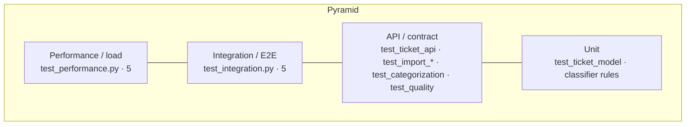

# Testing Guide — Intelligent Customer Support System

## Test pyramid



Most tests are fast unit/contract tests; a thin layer of end-to-end and performance tests
sits on top. All run in-process via FastAPI's `TestClient` against a freshly-built app, so
there is **no shared state** between tests.

## How to run

```bash
cd homework-2
python3 -m venv .venv
./.venv/bin/python -m pip install -r requirements-dev.txt

# all tests + coverage
./.venv/bin/python -m pytest --cov=src --cov-report=term-missing

# a single file / single test
./.venv/bin/python -m pytest tests/test_categorization.py -v
./.venv/bin/python -m pytest tests/test_ticket_api.py::test_combined_filter_by_category_and_priority

# the full quality gate (ruff · mypy · bandit · radon · coverage)
./demo/quality.sh

# HTML coverage report (open htmlcov/index.html)
./.venv/bin/python -m pytest --cov=src --cov-report=html
```

## Test suites & coverage targets

| File | Focus | Min required | Present |
|---|---|---|---|
| `test_ticket_api.py` | endpoints, status codes, filtering | 11 | 13 |
| `test_ticket_model.py` | model validation, bounds, enums | 9 | 9 (14 cases) |
| `test_import_csv.py` | CSV parse, errors, limits | 6 | 9 |
| `test_import_json.py` | JSON parse, malformed, wrapper | 5 | 5 |
| `test_import_xml.py` | XML parse, malformed, **XXE** | 5 | 5 |
| `test_categorization.py` | category & priority rules, endpoint | 10 | 13 cases |
| `test_integration.py` | lifecycle, bulk+classify, **concurrency 25**, combined filter | 5 | 5 |
| `test_performance.py` | benchmarks with asserted bounds | 5 | 5 |
| `test_quality.py` | error envelope, request-id, safe 500 | — | 6 |

Overall coverage gate: **≥ 95%** (`fail_under = 95` in `pyproject.toml`); current ≈ 98%.

## Sample / fixture data locations

- `tests/fixtures/` — small files used by the import tests: `valid.csv`, `invalid_row.csv`,
  `valid.json`, `valid.xml`, and `xxe.xml` (the security fixture).
- `samples/` — deliverable datasets: `sample_tickets.csv` (50), `sample_tickets.json` (20),
  `sample_tickets.xml` (30), plus `invalid_tickets.{csv,json,xml}` for negative testing.

## Manual testing checklist

- [ ] `./demo/run.sh` starts the API; `GET /health` returns `{"status":"ok"}`.
- [ ] `GET /docs` renders Swagger UI; every endpoint is listed.
- [ ] `POST /tickets` with a valid body → `201` and a generated `id`/timestamps.
- [ ] `POST /tickets` with a bad email / short description → `400` with `details[]`.
- [ ] `POST /tickets/import` with `samples/sample_tickets.csv` → `200`, `successful: 50`.
- [ ] Import `samples/invalid_tickets.csv` → partial success with per-row `errors`.
- [ ] Import `samples/invalid_tickets.json` / `.xml` → `400` malformed-file envelope.
- [ ] `POST /tickets/{id}/auto-classify` on a "production down / critical" ticket → `urgent`.
- [ ] `GET /tickets?category=…&priority=…` returns only matching tickets.
- [ ] `DELETE /tickets/{id}` → `204`; subsequent `GET` → `404`.
- [ ] Every response includes an `X-Request-ID` header.

## Performance benchmarks

| Scenario | Volume | Asserted bound |
|---|---|---|
| Create tickets | 200 sequential | < 10 s |
| Bulk import (CSV) | 500 rows | < 10 s |
| List all | 500 tickets | < 3 s |
| Filtered list | 500 tickets | < 3 s |
| Auto-classify | 100 calls, ~1.9 KB text | < 5 s |

Bounds are intentionally loose to avoid CI flakiness while still catching accidental
super-linear regressions.

---

*Generated with Claude Sonnet 4.6 — chosen for structured, checklist-style QA documentation.*
