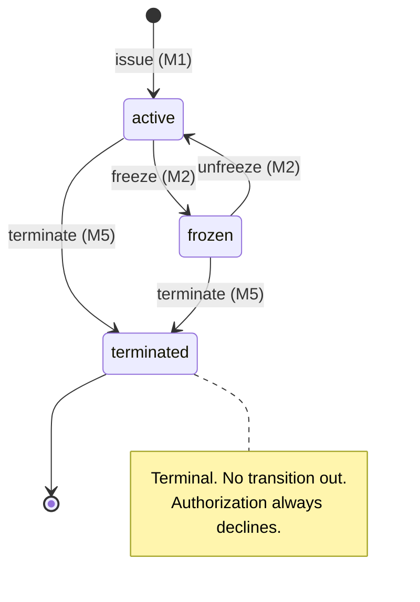

# Virtual Card Lifecycle — Specification

> Ingest the information from this file, implement the Low-Level Tasks, and generate the
> code that will satisfy the High- and Mid-Level Objectives. Treat the **Non-Functional &
> Policy**, **Implementation Notes**, **Edge Cases**, **Verification**, and **Performance**
> sections as binding acceptance constraints, not background reading. Every low-level task
> names the mid-level objective it serves (e.g. `→ M3`); do not implement a task in a way
> that violates a constraint from another section. Agent behaviour, autonomy boundaries
> (always / ask-first / never), and the runnable quality gate live in [`agents.md`](agents.md);
> the always-loaded rule subset is in [`.claude/CLAUDE.md`](.claude/CLAUDE.md).

---

**Status:** Draft for implementation · **Version:** 1.1 · **Last updated:** 2026-06-16 ·
**Owner:** Card Platform team. Change-controlled in Git; any material change updates this header
and the affected section.

### Contents
[Authority & sources of truth](#authority--sources-of-truth) · [High-Level Objective](#high-level-objective) ·
[Mid-Level Objectives](#mid-level-objectives) · [Non-Functional & Policy](#non-functional--policy) ·
[Implementation Notes](#implementation-notes-guardrails-an-agent-must-not-violate) ·
[Assumptions](#assumptions) · [Architecture & Key Flows](#architecture--key-flows) ·
[Domain Model](#domain-model) · [API Contract](#api-contract-authoritative-surface) ·
[Worked Example](#worked-example) · [Context](#context) · [Low-Level Tasks](#low-level-tasks) ·
[Edge Cases](#edge-cases--failure-modes) · [Verification](#verification) ·
[Expected Performance](#expected-performance) ·
[Traceability Matrix](#traceability-matrix-goals--tasks--verification)

### Authority & sources of truth
This spec is **authoritative and closed-world**: do **not** introduce endpoints, fields, status
values, error codes, dependencies, or libraries beyond those defined here. The *Error Code Catalog*,
*Domain Model*, and *API Contract* are the single sources of truth for their surfaces. If a needed
detail is missing or two sections conflict, **stop and ask** — never guess in a money or compliance
path. *How* the agent works (ask-don't-guess, dependency order, traceability, verification) lives in
[`agents.md`](agents.md); the always-loaded rule subset is in [`.claude/CLAUDE.md`](.claude/CLAUDE.md).

---

## High-Level Objective

Let an authenticated end-user **issue and control a virtual payment card** — create it,
freeze/unfreeze it, set spending limits, and review its transactions — while an internal
**ops/compliance** role can inspect any card and its immutable audit trail.

**Scope boundary:** this feature owns the *card lifecycle and its authorization-relevant
state* (status, limits, audit). It does **not** own card-network settlement, ledger/balance
truth, KYC onboarding, or PAN storage — those are external services this feature integrates
with (see *Context → Beginning context*).

---

## Mid-Level Objectives

Each objective is phrased as an **observable** change in the world (what an outside party can
confirm), and is the anchor for the low-level tasks and the verification section.

| ID | Objective | Observable success signal |
|----|-----------|---------------------------|
| **M1** | A user can **issue** a virtual card under their account | `POST /cards` returns a card in `active` status with a token + `last4`, never the full PAN; an `card.issued` audit event exists |
| **M2** | A user can **freeze and unfreeze** a card | Status transitions `active⇄frozen`; while `frozen`, authorization evaluation declines new spend; both transitions are audited |
| **M3** | A user can **set and adjust spending limits** (per-transaction and rolling window) | Limits persist with currency + amount; a transaction exceeding a limit is declined by M7; limit changes are audited with old→new values |
| **M4** | A user can **view a card's transactions**, paginated and filterable | `GET /cards/{id}/transactions` returns a stable, paginated, newest-first list scoped to that card and owner |
| **M5** | The card **lifecycle state machine** is enforced | Illegal transitions (e.g. `terminated → active`) are rejected with a typed error and never mutate state |
| **M6** | **Ops/compliance** can inspect any card + full audit trail (read-only) | An `ops` role can read any card and its complete, ordered, tamper-evident audit log; end-users cannot read others' cards |
| **M7** | An **authorization decision** honors status + limits + currency | Given a candidate spend, the system returns approve/decline with a machine-readable reason, deterministically and idempotently |

---

## Non-Functional & Policy

These apply across all objectives. Numbers labelled **(assumed target)** are hypothetical but
justified for FinTech UX/ops; teams should confirm against real SLOs before launch.

### Security
- **PCI-DSS scope minimization.** The application database **must never store the PAN or CVV.**
  Card credentials live only in a dedicated **PAN vault / tokenization service**; this feature
  stores a `card_token` and the **last 4 digits** for display. This keeps the service out of
  PCI-DSS "cardholder data environment" storage scope. *(→ Implementation Notes: PAN handling)*
- **Encryption.** TLS 1.2+ in transit; AES-256 (or KMS-managed envelope encryption) at rest for
  any sensitive column (token references, limit data linked to identity).
- **Authorization model.** Every endpoint enforces **ownership** (a user acts only on their own
  cards) and **role** (`user` vs `ops`). Default-deny; least privilege.
- **Idempotency & replay safety.** All state-changing endpoints require an `Idempotency-Key`
  and reject replays that differ in body (see Implementation Notes).

### Privacy
- **Data minimization.** Persist only what the feature needs: `card_token`, `last4`, owner id,
  status, limits, timestamps. No PAN, no CVV, no full cardholder PII beyond an opaque `owner_id`.
- **Regulatory.** Honour GDPR/CCPA data-subject rights: support **export** and **erasure
  requests** by tombstoning the card record while preserving audit entries required for
  regulatory retention (audit retention overrides erasure for the retained, minimized fields).
- **PII in logs.** Application logs and traces must contain **no PAN, no CVV, no full PII** —
  only `card_id`, `owner_id` (opaque), and `last4` where necessary.

### Audit & logging
- **Immutable, append-only audit trail.** Every state change (issue, freeze, unfreeze, limit
  change, termination) and every ops read of another user's card writes an ordered, tamper-
  evident `AuditEvent` (hash-chained or WORM-backed). Audit writes are part of the same logical
  transaction as the state change — **no state change without its audit record.**
- **Audit content:** actor (`user`/`ops` + id), action, `card_id`, before/after for changed
  fields (never sensitive values), request id, UTC timestamp, idempotency key.

### Reliability
- **Availability (assumed target):** 99.9% monthly for read paths, 99.95% for the
  authorization-evaluation path (it gates money movement; degradation must **fail closed** —
  decline rather than approve on uncertainty).
- **Consistency:** writes are strongly consistent within the card aggregate (status + limits +
  audit). Cross-service reads (e.g. transaction stream) may be eventually consistent; see
  performance *time-to-consistency*.

### Performance / SLO budgets
See the dedicated **Expected Performance** section for the full table; summarized here:
read endpoints **p95 ≤ 200 ms**, the authorization-evaluation path **p99 ≤ 50 ms** (it sits in
the payment hot path), state-changing writes **p95 ≤ 400 ms** including the audit write.

### Compliance
- Designed for a **regulated** environment: PCI-DSS (scope-minimized as above), SOC 2 change/
  access controls (audit trail + least privilege), and dispute-readiness (transaction views are
  reconcilable against the external ledger). Card issuance assumes upstream KYC/AML has cleared
  the account; this feature records but does not perform KYC.

---

## Implementation Notes (guardrails an agent must not violate)

- **Money.** Represent monetary amounts as **integer minor units** (e.g. cents) plus an ISO-4217
  `currency` code; never use binary floats for money. If a decimal type is used for arithmetic,
  use `Decimal`, and round **half-even** only at presentation. All amounts in a card's limits and
  its transactions must share the card's currency; cross-currency comparison is an error.
- **IDs.** `card_id` is a server-generated UUIDv4. The PAN is referenced only by an opaque
  `card_token` from the vault. Display uses `last4` only. Never put a PAN/token in a URL.
- **Idempotency.** State-changing endpoints require an `Idempotency-Key` header. Store
  `(key, owner_id, request_hash) → result` for ≥ 24h; a repeat with the same key+hash returns the
  original result, a repeat with a different hash returns `409 idempotency_conflict`.
- **Error semantics.** One error envelope `{ "error": <machine_code>, "message": <human>,
  "details": [...], "requestId": <uuid> }`. Use typed machine codes (e.g. `card_frozen`,
  `limit_exceeded`, `invalid_transition`, `not_found`, `forbidden`). HTTP codes: `200/201`,
  `400` validation, `403` **role-permission only**, `404` not-found **and** owner-mismatch (no
  existence leak), `409` conflict/idempotency, `422` illegal state transition, `429` rate limited,
  `503` dependency-down (fail closed). The *Error Code Catalog → Mapping rules* is authoritative on
  the `403`/`404`, validation-vs-`422`, and `details`-shape edge cases.
- **Concurrency.** The card aggregate carries a `version`; writes use optimistic concurrency
  (compare-and-set). A limit change and a concurrent freeze must not interleave to leave an
  inconsistent state — last writer must re-validate against current state or fail with `409`.
- **State machine is authoritative.** All transitions go through a single guarded function; no
  endpoint mutates `status` directly. Allowed transitions only (see Domain Model).
- **Time.** All timestamps UTC, ISO-8601 with offset; the server is the clock of record.
- **Determinism.** Authorization evaluation (M7) must be a **pure function** of (card snapshot,
  candidate transaction, window usage) so it is testable, explainable, and replay-safe.
- **Caller identity.** The API gateway authenticates the JWT and passes this feature the **verified**
  principal — `owner_id` (= token `sub`) and `role` (`user` | `ops`). This feature re-enforces
  ownership/role but does not parse raw JWTs; `401 unauthenticated` is the gateway's responsibility.
- **Error placement.** Typed error *classes* live in `domain/` so `domain` and `repo` can raise them
  without importing `platform`; only the HTTP envelope + status mapping live in `platform/errors`.
- **Atomicity.** A state change and its audit event commit **together** (one DB transaction / outbox
  in production; for the in-memory store, one logical operation that writes the audit only after the
  state write succeeds — both or neither).

### Error Code Catalog (authoritative)

Every error returned by this feature uses the envelope above with exactly one of these stable
machine codes. This catalog is the single source of truth — an implementer must not invent codes
or HTTP mappings outside it. (`401 unauthenticated` from the auth layer is assumed upstream.)

| Machine code | When it occurs | HTTP | Originates in |
|--------------|----------------|------|---------------|
| `validation_error` | Malformed body, unknown/extra field, negative/oversized limit | `400` | Tasks 7, 9 · E5 |
| `currency_mismatch` | Limit set in a currency ≠ the card's; or candidate spend currency ≠ card | `400` (set) / decline (authz) | Tasks 9, 10 · E6 |
| `forbidden` | Authenticated but not owner, or role lacks permission | `403` | Tasks 8–13 · E10 |
| `not_found` | Card does not exist, or is hidden to avoid existence disclosure | `404` | Tasks 8–13 · E10 |
| `idempotency_conflict` | Same `Idempotency-Key`, different request body | `409` | Task 5 · E3 |
| `version_conflict` | Optimistic-concurrency CAS failed (stale `version`) | `409` | Tasks 3, 9 · E4 |
| `invalid_transition` | State-machine rejects the transition (e.g. `terminated→active`) | `422` | Tasks 2, 8, 13 · E12 |
| `rate_limited` | Per-owner request rate exceeded | `429` | Task 15 |
| `dependency_down` | Required dependency (vault, etc.) unavailable — **fail closed** | `503` | Task 4 · E1 |

**Authorization decline reasons** (M7 `evaluate` returns these in the `Decision`, not as HTTP
errors — the decision itself is a successful `200` carrying approve/decline + reason):
`card_frozen`, `card_terminated`, `limit_exceeded`, `rolling_limit_exceeded`, `currency_mismatch`,
and `evaluation_unavailable` (fail-closed when an input is missing). *(→ Task 10, E7–E9)*

**Mapping rules (authoritative — resolve the ambiguous cases):**
- **Owner mismatch or unknown card → `404 not_found`** (never `403`), so the existence of another
  user's card is never disclosed. `403 forbidden` is used **only** for role-permission failures that
  do not reference a specific card id (e.g. a `user` calling an `ops` endpoint).
- **All body / field / query validation → `400 validation_error`** — including a missing required
  `Idempotency-Key` and a malformed pagination cursor. `422 invalid_transition` is reserved
  **exclusively** for the state machine; framework body-validation must be remapped to `400`.
- **`details`** is a (possibly empty) list of `{ "field": <string>, "message": <string> }` objects.

---

## Assumptions

Stated explicitly so the agent does not silently infer them; if reality differs, the affected
constraint must be revisited (record any deviation in `ASSUMPTIONS.md`).
- **Upstream KYC/AML has already cleared** the account before issuance — this feature records, but
  does not perform, KYC.
- **The external services in *Beginning context* exist and are reachable** (PAN vault, ledger /
  transaction stream, notifications, audit store, identity) and are injected + mockable.
- **JWTs are trustworthy and already verified** by the identity layer; `401 unauthenticated` is
  handled upstream, not by this feature.
- **All values marked *(assumed target)*** (SLOs, freshness, rate limits) are hypothetical defaults
  to confirm against real SLOs before launch.
- **A card has one fixed currency** for its lifetime; multi-currency cards are out of scope.
- **The single card aggregate is the consistency boundary**; portfolio / cross-card operations are
  out of scope.

---

## Architecture & Key Flows

Stateless service, four layers, dependencies pointing inward; `domain/` is pure (no I/O).

| Layer | Responsibility | Depends on |
|-------|----------------|-----------|
| `api` | HTTP handlers; authN/Z guard; idempotency; error envelope; rate limit; `X-Request-ID` | `services` |
| `services` | Use-case orchestration in **one transaction** (issue, status, limits, txn view) | `domain`, `repo`, `integrations`, `platform` |
| `domain` | Pure rules — `VirtualCard`, `transition()`, `evaluate()`; deterministic, no I/O | — |
| `repo` / `integrations` | Card store (optimistic CAS); vault, ledger/stream, notify, audit | external services |

**Ordering invariants — must hold in every flow:**
- **Issue (M1):** validate → idempotency check → vault issue (**fail closed: vault down → `503`, no
  card row, no audit**) → persist card **and** append audit **atomically** → best-effort notify → `201`.
- **State change (M2/M3/M5):** ownership/role → load (capture `version`) → pure `transition()` /
  validate → CAS write (stale `version` → `409`) → audit **in the same transaction** → best-effort
  notify. An idempotent replay returns the original result and writes **no** second audit event.
- **Authorize (M7):** load snapshot + window usage → pure `evaluate()` → `200` carrying
  approve/decline + reason; the decision is **never** persisted to card state.
- **Always:** no state change without its audit record; notifications are best-effort and never roll
  back a committed state change.

---

## Domain Model

### Entities (authoritative — field types & invariants are binding)
Types are language-neutral (map to the stack in `agents.md`). Money is integer **minor units**;
a `null` limit is an explicit, audited "unlimited". **No PAN/CVV field exists on any entity.**

**VirtualCard** — the aggregate and the consistency boundary:

| Field | Type | Constraint / invariant |
|-------|------|------------------------|
| `card_id` | UUIDv4 | server-generated, immutable, primary key |
| `owner_id` | string (opaque) | from JWT `sub`; immutable |
| `card_token` | string | opaque vault reference — **never** a PAN |
| `last4` | string(4) | digits only; display use only |
| `currency` | ISO-4217 | immutable for the card's life; validated as 3 uppercase letters (full ISO-4217 table check optional) |
| `status` | `CardStatus` | `active` \| `frozen` \| `terminated`; changes **only** via `transition()` |
| `per_txn_limit_minor` | int ≥ 0 \| null | card currency; null = unlimited |
| `rolling_window` | {`amount_minor` int ≥ 0, `period` `DAY`\|`WEEK`\|`MONTH`} \| null | null = unlimited; period durations in *Authorization decision logic* |
| `version` | int ≥ 1 | optimistic-concurrency token; +1 per committed state change |
| `created_at`,`updated_at` | UTC ISO-8601 | server is clock of record |
| `terminated_at` | UTC ISO-8601 \| null | set once, on terminate |

**TransactionView** — read model projected from the external stream; this feature never writes it.
The stream is keyed by `card_token`; the projection maps `card_token → card_id` for owner-scoping:
`txn_id` (pk) · `card_id` · `amount_minor` (int) · `currency` · `merchant` · `status`
(`pending`\|`posted`\|`declined`\|`reversed`) · `at` (UTC).

**AuditEvent** — append-only, hash-chained, one per state change; no PAN/CVV/PII:
`seq` (monotonic) · `prev_hash`/`hash` · `actor` {`role`,`id`} · `action`
(`card.issued`\|`card.frozen`\|`card.unfrozen`\|`limit.changed`\|`card.terminated`\|`ops.viewed`) ·
`card_id` · `changes` (before/after of changed fields only) · `request_id` · `idempotency_key?` · `at`.

**Decision** — output of `evaluate`: `{ approved: bool, reason: ReasonCode|null }`,
`ReasonCode ∈ {card_frozen, card_terminated, limit_exceeded, rolling_limit_exceeded, currency_mismatch, evaluation_unavailable}`.

### Core signatures (binding contracts)
- `transition(card, event) -> (CardStatus, ChangeRecord)` — pure; raises `invalid_transition` for any
  pair not in the transition table.
- `evaluate(snapshot, candidate_txn, window_usage_minor | None) -> Decision` — pure, deterministic, no I/O.
- `CardRepository`: `get(card_id)`, `put(card, expected_version)` (raises `version_conflict` on stale),
  `list_by_owner(owner_id, cursor, limit) -> Page`.
- `AuditLog`: `append(event) -> AuditEvent`, `verify_chain() -> bool`.
- `VaultClient`: `issue(currency) -> {card_token, last4}` — may raise `dependency_down`.

### Card status enum & lifecycle
`active`, `frozen`, `terminated`. Terminal: `terminated`.



### State transition table (authoritative)
`transition(card, event)` permits **exactly** these; any other pair → `invalid_transition` (`422`)
with no state mutation. Each permitted transition bumps `version` and writes one audit event.

| From ↓ \ Event → | freeze | unfreeze | terminate |
|------------------|--------|----------|-----------|
| **active** | → frozen | no-op¹ | → terminated |
| **frozen** | no-op¹ | → active | → terminated |
| **terminated** | reject | reject | no-op¹ |

¹ Idempotent no-op: returns success with **no** `version` bump and **no** new audit event.
(`issue` creates the card in `active`; it is not a transition on an existing card.)

### Authorization decision logic (precedence — `evaluate`, M7)
Authorization is a function of `status` + limits + currency, with rolling-window usage read from the
external stream — never of the card row's own state. `evaluate` checks in this **exact order** and
returns on the **first** match (so the outcome is deterministic and explainable):

1. a **required** input is missing — `card` or `txn` absent, **or** a rolling window is configured
   but its `window_usage` could not be fetched (`is None`) → decline `evaluation_unavailable`
   *(fail closed)*. A card with **no** rolling window does not require `window_usage`.
2. `status == terminated` → decline `card_terminated`
3. `status == frozen` → decline `card_frozen`
4. `txn.currency != card.currency` → decline `currency_mismatch`
5. `per_txn_limit != null` and `txn.amount_minor > per_txn_limit` → decline `limit_exceeded`
6. `rolling != null` and `window_usage + txn.amount_minor > rolling.amount_minor` → decline `rolling_limit_exceeded`
7. otherwise → **approve**

Comparisons are strict (`>`): `amount == limit` **approves**; `amount == limit + 1` declines (E8).

**Rolling window semantics:** `DAY` / `WEEK` / `MONTH` are rolling look-back durations of **1 / 7 /
30 days** ending at evaluation time (not calendar months). `window_usage` is the sum of `posted` +
`pending` transaction amounts within that window; `declined` / `reversed` do **not** accrue.

---

## API Contract (authoritative surface)

These are the **only** endpoints. All require a verified principal and enforce ownership; all
mutations require an `Idempotency-Key`. HTTP/codes per the *Error Code Catalog* (incl. its **mapping
rules**); every response carries `X-Request-ID`. `{id}` is a `card_id` (UUIDv4). Another user's card
→ `404` (never `403`, no existence disclosure); `403` is only for role failures (e.g. `user` → ops).

| Method & path | Role | Mutates | Success | Primary error codes | Task |
|---------------|------|---------|---------|---------------------|------|
| `POST /cards` | user | yes | `201` card | `validation_error`, `dependency_down` | 7 |
| `GET /cards/{id}` | owner | no | `200` card | `forbidden`/`not_found` | 11 |
| `POST /cards/{id}/freeze` | owner | yes | `200` card | `forbidden`/`not_found`, `invalid_transition` | 8 |
| `POST /cards/{id}/unfreeze` | owner | yes | `200` card | `forbidden`/`not_found`, `invalid_transition` | 8 |
| `PUT /cards/{id}/limits` | owner | yes | `200` card | `validation_error`, `currency_mismatch`, `version_conflict`, `invalid_transition` | 9 |
| `POST /cards/{id}/terminate` | owner or ops | yes | `200` card | `forbidden`/`not_found`, `invalid_transition` | 13 |
| `GET /cards/{id}/transactions` | owner | no | `200` page | `forbidden`/`not_found`, `validation_error` | 11 |
| `GET /ops/cards/{id}` | ops | no (audits read) | `200` card + audit chain | `forbidden` | 12 |

**Pagination (list endpoints).** Response shape `{ "items": [...], "next_cursor": <string|null> }`
(`next_cursor` is `null` on the last page). `?limit=` defaults to **50**, max **100**; ordering is
`(at desc, txn_id desc)`. The cursor is **opaque** — URL-safe base64 of `"<at>|<txn_id>"`, passed
back as `?cursor=`; a malformed cursor → `400 validation_error`.

**Authorization (M7)** is an internal **pure evaluation** (`evaluate`) invoked by the payment path —
not a user-facing REST endpoint in this feature's scope.

---

## Worked Example

Concrete instances that fix the contract — a real example beats prose. Values are illustrative and
IDs/tokens are fake. Note that responses carry `card_token` + `last4`, **never** a PAN, and money is
integer minor units.

**Issue a card** — `POST /cards` → `201 Created`:
```http
POST /cards   Authorization: Bearer <jwt: sub=owner_42, role=user>   Idempotency-Key: 0d1c…e9

{ "currency": "USD", "per_txn_limit_minor": 50000,
  "rolling_window": { "amount_minor": 200000, "period": "MONTH" } }
```
```json
{ "card_id": "8f3b…", "owner_id": "owner_42", "card_token": "tok_live_…", "last4": "4242",
  "currency": "USD", "status": "active", "per_txn_limit_minor": 50000,
  "rolling_window": { "amount_minor": 200000, "period": "MONTH" },
  "version": 1, "created_at": "2026-06-16T12:00:00Z" }
```

**Set limits** — `PUT /cards/{id}/limits` (full replace) → `200` card:
```http
PUT /cards/8f3b…/limits   Authorization: Bearer <…owner_42…>   Idempotency-Key: 7a2f…b1

{ "per_txn_limit_minor": 75000, "rolling_window": { "amount_minor": 300000, "period": "MONTH" } }
```
→ audited `limit.changed` (before→after); `version` becomes `2`. Send `null` for either field to set
"unlimited" (explicitly audited). An optional `currency` ≠ the card's → `400 currency_mismatch`.

**Authorization** — `evaluate(card_snapshot, candidate_txn, window_usage) → Decision` (pure; M7):
```jsonc
{ "approved": true,  "reason": null }                     // 45000 ≤ per-txn 50000, within window
{ "approved": false, "reason": "limit_exceeded" }         // boundary: amount 50001 == limit 50000 + 1
{ "approved": false, "reason": "evaluation_unavailable" } // fail-closed: window usage unfetchable
```

**Error envelope** — every **HTTP error** path uses this shape; `error` is a code from the *Error
Code Catalog* (here, freezing a terminated card → `422 invalid_transition`). Note this is distinct
from an authorization *decline*, which is a `200` carrying a `Decision` reason like `card_frozen`:
```json
{ "error": "invalid_transition", "message": "Cannot freeze a terminated card.", "details": [], "requestId": "5e2a…" }
```

---

## Context

### Beginning context (exists before work starts — hypothetical but fixed)
- **Identity/Auth service** issues verified JWTs carrying `subject` (= `owner_id`) and `role`
  (`user` | `ops`). This feature trusts and verifies these tokens; it does not do login.
- **PAN vault / tokenization service** (external): `POST /vault/cards` → `{card_token, last4}`;
  the PAN/CVV never leave the vault.
- **Transaction stream / ledger** (external, source of truth for posted transactions): provides
  a read API for transactions by `card_token`; balances and settlement live here, not in scope.
- **Notification service** (external): accepts events to fan out to user channels.
- **Audit store**: append-only / WORM-capable storage for `AuditEvent`s.
- **Empty application repo** for this feature: language/runtime toolchain available; no domain
  code yet.

### Ending context (exists after work is complete)
- A card-lifecycle service exposing the endpoints in the task list, backed by a card datastore
  (status, limits, token reference, version) — **no PAN/CVV stored**.
- An enforced state machine, an idempotency store, and a hash-chained audit trail.
- A test suite (unit/integration/e2e as documentation in this homework) and fixtures.
- Operational docs: runbook for the authorization fail-closed behavior, and a reconciliation
  procedure against the external ledger.

### Module layout (target)
Consolidates the per-task `File:` targets so structure lives in one place (layering: deps inward,
`domain/` free of framework/I/O):

```text
src/
  api/          # thin handlers: cards, transactions, ops      (Tasks 7,8,9,11,12)
  services/     # issue, status, limits, txn_view              (Tasks 7,8,9,11,13)
  domain/       # card, lifecycle, authorize — no framework/IO (Tasks 1,2,10)
  repo/         # card_repo (optimistic concurrency)           (Task 3)
  integrations/ # vault, notify, stream (txn/ledger reader)    (Tasks 4,16,10,11)
  platform/     # idempotency, audit, errors, middleware       (Tasks 5,6,14,15)
tests/          # unit · integration · e2e · compliance        (Tasks 17–20)
```

---

## Low-Level Tasks

Each task is an executable slice. It names the **objective it serves**, the **artifact** to
create/update, and a **Definition of Done (DoD)** an implementer can check off. Tasks are
ordered so each builds on the previous (foundations → behavior → cross-cutting → verification).

### 1. Card aggregate & status enum  → M5
- **Prompt:** "Create the `VirtualCard` aggregate and `CardStatus` enum per the Domain Model,
  with money as integer minor units + ISO-4217 currency, and an optimistic-concurrency `version`."
- **File:** `src/domain/card.{ext}` · **Symbol:** `VirtualCard`, `CardStatus`
- **Details:** No PAN/CVV fields. `last4` is 4 chars; `card_token` opaque. Validation: currency
  is ISO-4217; limits ≥ 0 or explicitly null.
- **DoD:** Constructing a card with a PAN field is impossible (no such field); invalid currency
  rejected; `version` starts at 1.

### 2. Guarded state-machine transition function  → M5
- **Prompt:** "Implement a single `transition(card, event)` that allows only the moves in the
  *State transition table* and raises `invalid_transition` otherwise."
- **File:** `src/domain/lifecycle.{ext}` · **Symbol:** `transition`
- **Details:** Pure function; returns the new status + the change record for audit. No I/O. Behaviour
  is exactly the *State transition table* (incl. idempotent no-ops).
- **DoD:** `terminated → active` raises `invalid_transition`; `active → frozen → active` works;
  unit tests cover every legal and at least 3 illegal transitions.

### 3. Card repository (no PAN) with optimistic concurrency  → M1, M5
- **Prompt:** "Create a `CardRepository` interface + in-memory impl storing the aggregate with
  compare-and-set on `version`."
- **File:** `src/repo/card_repo.{ext}` · **Symbol:** `CardRepository`
- **Details:** `get/put/list_by_owner`; `put` fails with `version_conflict` if `version` stale.
- **DoD:** Concurrent `put` with stale version returns conflict; no sensitive fields persisted.

### 4. PAN vault client (tokenization)  → M1
- **Prompt:** "Create a `VaultClient.issue()` that calls the external vault and returns
  `{card_token, last4}`; the PAN never enters this service."
- **File:** `src/integrations/vault.{ext}` · **Symbol:** `VaultClient`
- **Details:** Timeout + retry with idempotency; on vault failure, issuance fails closed (no card
  row created). Mockable in tests.
- **DoD:** Returned object has no PAN; vault timeout yields `503 dependency_down`, no card created.

### 5. Idempotency store & middleware  → M1, M2, M3 (cross-cutting)
- **Prompt:** "Implement an idempotency layer keyed by `(Idempotency-Key, owner_id, body_hash)`
  with ≥24h TTL per Implementation Notes."
- **File:** `src/platform/idempotency.{ext}` · **Symbol:** `Idempotency`
- **Details:** Same key+hash → cached result; same key, different hash → `409
  idempotency_conflict`.
- **DoD:** Replaying a freeze returns the original result and produces **no second** audit event.

### 6. Hash-chained audit log  → M6 (cross-cutting)
- **Prompt:** "Create an append-only `AuditLog` where each event stores `prev_hash` and a
  computed `hash`, written in the same transaction as the state change."
- **File:** `src/platform/audit.{ext}` · **Symbol:** `AuditLog`
- **Details:** Never log PAN/CVV/PII; record before/after of changed fields only. Provide a
  `verify_chain()` integrity check.
- **DoD:** Tampering with any event breaks `verify_chain()`; every state-changing task below
  emits exactly one audit event.

### 7. Issue card  → M1
- **Prompt:** "Implement `POST /cards`: verify auth, call vault, persist an `active` card, emit
  `card.issued`, return the card (token + last4, no PAN)."
- **File:** `src/api/cards.{ext}` + `src/services/issue.{ext}` · **Symbol:** `issue_card`
- **Details:** Requires `Idempotency-Key`. Currency from request, validated. Owner = token subject.
- **DoD:** `201` with `status=active`, `last4` present, PAN absent; audit `card.issued` exists;
  replay with same key returns the same card and creates no duplicate.

### 8. Freeze / unfreeze  → M2
- **Prompt:** "Implement `POST /cards/{id}/freeze` and `/unfreeze` through the guarded
  transition; enforce ownership."
- **File:** `src/api/cards.{ext}` + `src/services/status.{ext}` · **Symbol:** `set_frozen`
- **Details:** Idempotent (freezing a frozen card is a no-op success, **not** a second audit
  event). Non-owners → `404` (no existence leak; see Catalog *Mapping rules*).
- **DoD:** `active→frozen→active` audited twice; freezing twice audited once; non-owner → `404`.

### 9. Set / adjust spending limits  → M3
- **Prompt:** "Implement `PUT /cards/{id}/limits` (full replace) setting per-transaction and rolling
  limits with non-negative validation; audit old→new."
- **File:** `src/api/cards.{ext}` + `src/services/limits.{ext}` · **Symbol:** `set_limits`
- **Details:** **PUT replaces the whole limit set** — both `per_txn_limit_minor` and `rolling_window`
  are sent (each may be `null` = explicit, audited "unlimited"). An optional `currency` field, if
  present, must equal the card's (else `400 currency_mismatch`). A limit change is a **versioned,
  audited state change** (bumps `version`, writes `limit.changed`) and is rejected on a terminated
  card with `422 invalid_transition`. Reject negative/oversized values with `400 validation_error`.
- **DoD:** Negative/oversized → `400`; currency mismatch → `400`; on terminated → `422`; audit shows
  before→after; concurrent change with stale `version` → `409`.

### 10. Authorization evaluation (pure)  → M7
- **Prompt:** "Implement `evaluate(card_snapshot, candidate_txn, window_usage) → Decision`
  returning approve/decline + machine reason, as a pure function."
- **File:** `src/domain/authorize.{ext}` · **Symbol:** `evaluate`
- **Details:** Implement exactly the *Authorization decision logic (precedence)* — the ordered
  checks, strict-`>` boundary, and *Rolling window semantics* — returning a `Decision`. `evaluate`
  does **no I/O**; the orchestrating service supplies `window_usage` from the `integrations/stream`
  client and fails closed (`evaluation_unavailable`) if it cannot be fetched.
- **DoD:** Pure and deterministic; unit tests for each decline reason **in precedence order** + an
  approval + the exact boundary (`amount == limit` approves, `amount == limit+1` declines).

### 11. Card & transaction read endpoints  → M4
- **Prompt:** "Implement owner-scoped reads: `GET /cards/{id}` (the card) and
  `GET /cards/{id}/transactions` projecting the external stream into a newest-first,
  cursor-paginated list with optional `status` filter."
- **File:** `src/api/cards.{ext}` + `src/api/transactions.{ext}` + `src/services/txn_view.{ext}` ·
  **Symbol:** `get_card`, `list_txns`
- **Details:** `GET /cards/{id}` returns the card (token + `last4`, no PAN), strongly consistent with
  the owner's own writes. Transactions are read via the `integrations/stream` client and returned per
  the API Contract's **Pagination** rules (opaque cursor, default 50, max 100, `(at desc, txn_id
  desc)`); reflect the stream's eventual consistency (see Performance).
- **DoD:** `GET /cards/{id}` returns the owner's card and `404` for others (no existence leak);
  pagination returns no dupes/gaps across pages; empty card → empty `items`, not error.

### 12. Ops/compliance read view  → M6
- **Prompt:** "Add an `ops`-only `GET /ops/cards/{id}` returning the card + full audit trail,
  and record an `ops.viewed` audit event for the access itself."
- **File:** `src/api/ops.{ext}` · **Symbol:** `ops_get_card`
- **Details:** Role check (`ops`); ops reading another user's card is itself audited (access
  transparency). Returns the hash-chain so integrity is verifiable.
- **DoD:** `user` role → `403`; `ops` read of any card succeeds and emits `ops.viewed`;
  `verify_chain()` passes over the returned trail.

### 13. Terminate card  → M5
- **Prompt:** "Implement `POST /cards/{id}/terminate` (owner or ops) → terminal `terminated`."
- **File:** `src/services/status.{ext}` · **Symbol:** `terminate_card`
- **Details:** Idempotent; after terminate, all authorization declines and limit/freeze ops return
  `422 invalid_transition`.
- **DoD:** Post-terminate freeze → `422`; authorization → decline `card_terminated`; audited once.

### 14. Error envelope & exception mapping  → cross-cutting
- **Prompt:** "Centralize the `{error, message, details, requestId}` envelope and map typed
  domain errors to the HTTP codes in the Error Code Catalog."
- **File:** `src/platform/errors.{ext}` (HTTP mapping) — error *classes* live in `src/domain/errors`
  so `domain`/`repo` raise them without importing `platform` · **Symbol:** `error_envelope`
- **Details:** Apply the Catalog's *Mapping rules*: owner-mismatch/unknown → `404`; role-only →
  `403`; all body/query validation → `400 validation_error` (remap the framework's default `422`).
- **DoD:** Every documented error path returns the envelope with a stable machine `error` code;
  framework validation surfaces as `400`, not `422`; no stack traces leak; `requestId` on all responses.

### 15. Rate limiting & request id  → NFR (security/perf)
- **Prompt:** "Add per-owner rate limiting and an `X-Request-ID` on every response."
- **File:** `src/platform/middleware.{ext}` · **Symbol:** `rate_limit`, `request_id`
- **Details:** Default (assumed) 100 req/min/owner; `429` with envelope on breach. The per-owner
  limiter runs **after** the principal is resolved (in the auth dependency, not as raw middleware,
  which cannot see the owner); `X-Request-ID` is true middleware on every response.
- **DoD:** 101st request in a minute → `429`; every response carries `X-Request-ID`.

### 16. Notifications on lifecycle events  → M2, M3 (supporting)
- **Prompt:** "Emit notification events on freeze, unfreeze, limit change, and termination."
- **File:** `src/integrations/notify.{ext}` · **Symbol:** `notify`
- **Details:** Best-effort, **non-blocking**: a notification failure must not fail or roll back the
  state change (the audit event is the system of record, the notification is not).
- **DoD:** Notification outage does not block freeze; state + audit still succeed.

### 17–20. Verification slices  → all M*
- **17 Unit tests (domain):** state machine, `evaluate` decision matrix incl. boundaries, money
  validation. **DoD:** ≥1 test per legal/illegal transition and per decline reason.
- **18 Integration tests (service+repo+audit+idempotency):** issue→freeze→limit→authorize→
  terminate; replay safety; concurrency conflict. **DoD:** idempotent replay creates no dup
  audit; stale-version write → `409`.
- **19 E2E/contract tests (API):** each endpoint's status codes, ownership/role, envelope.
  **DoD:** ownership `403`, role `403`, pagination stability all asserted.
- **20 Compliance/reconciliation checks (documented):** audit-chain integrity job; a
  reconciliation procedure comparing the transaction read-model against the external ledger.
  **DoD:** `verify_chain()` runs in CI; reconciliation runbook exists.

---

## Edge Cases & Failure Modes

Scoped to the virtual-card feature. "Expected behavior" gives the user-visible outcome **and**
the audit/compliance implication where relevant.

| # | Scenario | Expected behavior |
|---|----------|-------------------|
| E1 | Issue while PAN vault is down | `503 dependency_down`; **no** card row created (fail closed); no `card.issued` audit; user may retry with same idempotency key |
| E2 | Replay of a state-changing request (same key+body) | Original result returned; **no** second state change and **no** duplicate audit event |
| E3 | Replay with same key, different body | `409 idempotency_conflict`; no state change |
| E4 | Concurrent freeze + limit change on one card | Optimistic concurrency: one succeeds (audited as a state change), the other gets `409 version_conflict`; final state consistent. The failed attempt is **not** written to the immutable state-change audit chain (no state changed) but is recorded as an operational/security log event for forensics |
| E5 | Set negative / non-numeric / oversized limit | `400 validation`; no change; not audited as a limit change |
| E6 | Set limit in a different currency than the card | `400 currency_mismatch`; no change |
| E7 | Authorize a spend on a frozen card | Decline `card_frozen`; decision is deterministic and explainable; no state change |
| E8 | Spend exactly at the per-txn limit vs one minor unit over | `amount == limit` → approve; `amount == limit + 1` → decline `limit_exceeded` (boundary defined, not implementation-dependent) |
| E9 | Rolling-window limit: usage stale vs. fresh | Evaluation uses the latest window usage; if usage cannot be fetched, **fail closed** → decline `evaluation_unavailable` |
| E10 | User A reads/acts on User B's card | `404` (never `403`) — **no existence disclosure**; attempt is logged (security event) |
| E11 | Ops reads a user's card | Allowed; the access itself is audited (`ops.viewed`) for access transparency |
| E12 | Terminate, then freeze/limit/authorize | `422 invalid_transition` for freeze/limit; authorize declines `card_terminated`; terminate is idempotent |
| E13 | Empty transaction list / new card | `200` with empty page (not `404`); stable empty cursor |
| E14 | Pagination across concurrent inserts | Cursor ordering `(at desc, txn_id desc)` yields no duplicates or skips when new txns arrive mid-paging |
| E15 | Suspected fraud pattern (rapid repeated declines / velocity) | Out of scope to *decide* fraud, but each decline is audited with reason so an external fraud system can act; document the hook |
| E16 | Notification service down during freeze | Freeze + audit succeed; notification retried/queued; failure never rolls back the state change |
| E17 | Clock skew / duplicate timestamps | Server UTC is authoritative; ties broken by `txn_id`/`seq` so ordering is total |

The **operational/security log** referenced by E4 and E10 is separate from the immutable audit chain
and carries **no PII**; its sink and schema are out of scope for this feature (the audit chain is the
system of record). The fraud hook (E15) is likewise expose-only.

---

## Verification

How each mid-level objective is **known** to be met. Test categories below are specified **as
documentation** (this homework requires no implementation); they define what an implementer or
reviewer would check.

| Objective | Verification method |
|-----------|---------------------|
| **M1 Issue** | Integration test: issue → assert `active`, `last4` present, PAN absent, `card.issued` audited; E1 (vault down → no card); replay (E2) creates no duplicate. Compliance review: confirm no PAN/CVV column exists in the schema. |
| **M2 Freeze/unfreeze** | Unit: legal transitions; Integration: freeze blocks authorization (ties to M7); idempotent re-freeze (E2). |
| **M3 Limits** | Unit: validation (E5/E6); Integration: limit change audited old→new; authorization respects new limit at the boundary (E8). |
| **M4 Transactions** | Contract test: pagination stability (E14), empty list (E13), owner scoping (E10). Reconciliation check vs external ledger (Task 20). |
| **M5 State machine** | Unit: every legal + ≥3 illegal transitions (Task 2); post-terminate guards (E12). |
| **M6 Ops + audit** | Integration: role enforcement (E10/E11); `verify_chain()` integrity passes and fails on tamper (Task 6); `ops.viewed` recorded. |
| **M7 Authorization** | Unit: full decision matrix incl. boundaries and fail-closed (E7/E8/E9); property test: `evaluate` is pure/deterministic for identical inputs. |

**Review checkpoints (manual):** (a) schema review confirming PCI scope minimization; (b)
log/trace review confirming no PAN/PII; (c) audit-chain integrity check in CI; (d) reconciliation
runbook walkthrough; (e) threat-model review of ownership/role boundaries.

**Fixtures:** a frozen card, an active card at exactly its per-txn limit, a card with a nearly
exhausted rolling window, a terminated card, and a card owned by "another user" for `403` tests.

---

## Expected Performance

Measurable targets. Values marked **(assumed)** are hypothetical but justified for FinTech UX/ops.

| Path | Target | Rationale |
|------|--------|-----------|
| Authorization evaluation (M7) | **p99 ≤ 50 ms**, **p50 ≤ 10 ms** (assumed) | Sits in the payment hot path; networks expect sub-100 ms auth decisions, so the in-house portion must be tight. |
| Read endpoints (get card, list txns) | **p95 ≤ 200 ms** (assumed) | Interactive UX; users perceive < 200 ms as instant. |
| State-changing writes (issue/freeze/limit) | **p95 ≤ 400 ms** incl. audit write (assumed) | Acceptable for occasional actions; budget includes the synchronous audit + vault call on issue. |
| Transaction list pagination | **page size default 50, max 100**; cursor-based | Bounds payload + DB work; cursor avoids deep-offset cost and is stable under inserts (E14). |
| Rate limit | **100 req/min/owner** (assumed) | Abuse/runaway-client guard; generous for human use, low enough to bound load. |
| Read-after-write (own card status/limits) | **strongly consistent (0 ms staleness)** | Same aggregate; users must see their own change immediately. |
| Transaction read-model freshness | **time-to-consistency ≤ 5 s** (assumed) | Projected from an external eventually-consistent stream; 5 s is acceptable for a transaction list and is labelled so in the UI ("may take a few seconds"). |
| Availability | **99.9% reads / 99.95% authorization** (assumed) | Authorization gates money movement and fails **closed**, so its availability target is higher and its failure mode is "decline", never "approve". |

Throughput is expected to scale horizontally (stateless service; card aggregate keyed by
`card_id`); the audit store is the main write-amplification point and should be append-optimized.

---

## Traceability Matrix (goals → tasks → verification)

| Mid-level | Low-level tasks | Edge cases | Verification |
|-----------|-----------------|-----------|--------------|
| M1 Issue | 1, 3, 4, 5, 7 | E1, E2, E3 | M1 row above |
| M2 Freeze/unfreeze | 2, 8, 16 | E2, E7, E16 | M2 row |
| M3 Limits | 9, 16 | E4, E5, E6 | M3 row |
| M4 Transactions | 11 | E13, E14 | M4 row |
| M5 State machine | 1, 2, 13 | E12 | M5 row |
| M6 Ops + audit | 6, 12 | E10, E11 | M6 row |
| M7 Authorization | 10 | E7, E8, E9, E15 | M7 row |
| Cross-cutting (NFR) | 5, 6, 14, 15 | E2–E4, E10, E17 | Review checkpoints |

Every low-level task traces up to at least one mid-level objective, and every mid-level
objective traces down to tasks, edge cases, and a verification method — satisfying the
goal-to-task traceability the homework grades.
