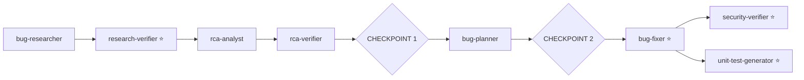

# Homework 4 — 4-Agent Bug-Fix Pipeline

**Author:** Anton Tsiatsko · **Stack:** Python 3.11 · pytest · ruff/mypy/bandit/radon · Claude Code agents + skills

A single-command, **sequential multi-agent pipeline** (Architect/Editor pattern) that takes a tiny
app (`paycli`) with seeded bugs + a security vulnerability and **researches → verifies →
root-causes → plans → fixes → security-reviews → tests** it — with **two human checkpoints** and a
full, immutable audit trail per run. Built to Alexey-Popov's *WORK-Agents* guide. Design in
[`PLAN.md`](PLAN.md); verification contract in [`TEST_PLAN.md`](TEST_PLAN.md).

## The pipeline

⭐ = the **4 required graded agents**; researcher / RCA / planner are guide-aligned **helper stages**
so the flow matches the *WORK-Agents* canonical pipeline.

## Run it
See [`HOWTORUN.md`](HOWTORUN.md). TL;DR (after `pip install -e ".[dev]"`):
`./run-pipeline.sh` (macOS/Linux) or `pwsh ./run-pipeline.ps1` (Windows).

## Agents & model selection (Architect / Editor)
Per the guide's two cognitive modes — **Architect** (plan/research/verify → reason deeply →
*read-only* → **Opus**) and **Editor** (implement → act → *write* → **Sonnet**):

| Agent | Mode · Model | Tools | Why this model |
|-------|--------------|-------|----------------|
| bug-researcher | Architect · Opus | read-only | careful "document what exists" |
| research-verifier ⭐ | Architect · Opus | read-only | fact-checking judgment |
| rca-analyst | Architect · Opus | read-only | 5-Whys causal reasoning |
| rca-verifier | Architect · Opus | read-only | validate the causal logic |
| bug-planner | Architect · Opus | read-only | design the fix precisely |
| bug-fixer ⭐ | Editor · Sonnet | write | routine, fast code edits |
| security-verifier ⭐ | Architect · Opus | read-only | security judgment; report-only |
| unit-test-generator ⭐ | Editor · Sonnet | write | test scaffolding |

Opus for deep reasoning + read-only safety on the verify/plan stages; Sonnet for fast, ~5× cheaper
write work (fix + tests) — "right model for the right task."

## Skills
- `research-quality-measurement` — quality levels + the `verified-research.md` template (used by research-verifier).
- `unit-tests-FIRST` — the FIRST checklist (used by unit-test-generator).

## Run capture & traceability
Each run creates an immutable `context/bugs/001/runs/run-<UTC>/` with, in execution order:
per-stage `NN-agent_log.md` (compact decision log) + `NN-agent_result.md` (full result + `Handoff`),
`04-CHECKPOINT-1.md`, `06-CHECKPOINT-2.md`, `manifest.json`, `pipeline-run.log`. The latest results
are copied to the canonical artifacts in `context/bugs/001/`.
`cat context/bugs/001/runs/run-*/*_result.md` replays the whole pipeline top-to-bottom.

## Results (latest run)
Live run `run-2026-06-21T19-18-05Z` (manifest `completed`) — 8 stages + 2 checkpoints. **`./verify.sh`: 46/46 P0 pass** (the 4 author screenshots are the only pending items).

| Check | Result |
|-------|--------|
| Bugs fixed | BUG-A `<=` · BUG-B empty-guard · VULN-1 no-shell · VULN-2 env var |
| Tests | baseline + generated + CLI green; **coverage 100%** (gate ≥ 90) |
| Security | `bandit` clean (was `B602` HIGH pre-fix); injection no longer executes |
| Quality gate | ruff · mypy · radon (no C+) · bandit · pytest — all green |
| Structure | matches TASKS.md *Expected Project Structure* + all *Deliverables* |

**Stronger proofs** (`docs/proofs/`):

| # | Proof | Result |
|---|-------|--------|
| A | E2E green | `verify.sh` 46/46 → `verify-output.txt` |
| B | surprise *undocumented* bug | security-verifier independently caught an unseeded `eval()` **RCE (CRITICAL)** + 4 more → `surprise-bug.txt` |
| C | human checkpoint gate | approve → continue (exit 0); reject → stop (exit 3) + recorded → `checkpoint-gate.txt` |
| D | immutability | 2nd run = new folder; 1st byte-identical (hash unchanged) → `immutability.txt` |

## Task → deliverable → evidence
| HW4 Task | Deliverable(s) | Evidence |
|----------|----------------|----------|
| 1 — Research Verifier (+ quality skill) | `agents/research-verifier.agent.md`, `skills/research-quality-measurement.md`, `verified-research.md` | `docs/screenshots/pipeline-run.png` |
| 2 — Bug Fixer | `agents/bug-fixer.agent.md`, `fix-summary.md`, fixed `src/` | `docs/screenshots/fixes-applied.png` |
| 3 — Security Verifier | `agents/security-verifier.agent.md`, `security-report.md` | `docs/screenshots/security-scan.png` |
| 4 — Unit Test Generator (+ FIRST skill) | `agents/unit-test-generator.agent.md`, `skills/unit-tests-FIRST.md`, `tests/`, `test-report.md` | `docs/screenshots/unit-tests.png` |
| 5 — Sample app (≥2 bugs + ≥1 vuln, before/after) | `src/paycli/*`, `context/bugs/001/bug-context.md` | `docs/screenshots/pipeline-run.png` |
| Single command + models + checkpoints | `run-pipeline.sh` / `.ps1`, per-agent `model:`, `CHECKPOINT-*.md` | run folder |

## Verify
`./verify.sh` runs the scriptable TEST_PLAN checks (quality gate + artifacts + run capture + fixes).
